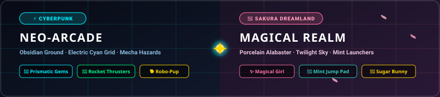
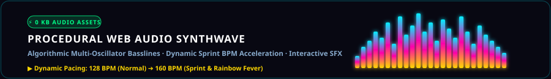

<p align="center">
  
</p>

<div align="center">

[](https://3dcrystalcollector.netlify.app/)
[](https://github.com/lumidren/crystal-collector/releases/latest)
[](https://github.com/lumidren/crystal-collector)
[](https://github.com/lumidren/crystal-collector)
[](LICENSE)

<br/>

**A high-octane 3D neo-arcade platformer built with React 19, Three.js & Electron.**  
Traverse 10 procedural biomes across a massive 76×76m arena, scale multi-tier vertical sky islands, adopt 3D animated companions, pilot 6 distinct heroes with signature abilities, conquer the Level 10 Guardian Titan boss, and experience dual visual worlds (*Cyberpunk Neon* & *Sakura Dreamland*)!

[🎮 **Play in Browser**](https://3dcrystalcollector.netlify.app/) · [📦 **Download Windows Standalone (.exe)**](https://github.com/lumidren/crystal-collector/releases/latest) · [🐛 **Report Bug**](https://github.com/lumidren/crystal-collector/issues)

</div>

---

## ⚡ Quick Start

### 🪟 Windows Standalone (Zero Installation Required)
1. Download the latest portable release:
   - **`Crystal Collector 2.0.0.exe`** (Single-file portable Windows executable)
   - Or extract `release/win-unpacked/` and run `Crystal Collector.exe`.
2. Launch and play instantly at locked 60 FPS with native desktop hardware acceleration!

### 🚀 1-Click Launch Scripts
- **`PLAY.bat`**: Launches the web production build immediately in your default browser.
- **`PLAY-DESKTOP.bat`**: Launches the native desktop Electron app directly.

---

## 🎭 Dual Aesthetic Themes

<p align="center">
  
</p>

Switch seamlessly between two completely handcrafted visual presentations via the Home Screen toggle or Developer Root Console:

| Dimension | ⚡ Cyberpunk Neo-Arcade | 🌸 Sakura Dreamland (Enchanted) |
| :--- | :--- | :--- |
| **Arena Ground** | Deep obsidian carbon with electric cyan grid lines | **Polished Porcelain Alabaster** (`0xede8f2`) with soft lavender-slate grid |
| **Sky & Ambience** | Dark cosmic void with amber star tints | **Deep Midnight Twilight Dome** (`0x16132b`) with 1,500 pastel stars |
| **Atmospheric Fog** | Cyberpunk dense fog (`near: 26m`, `far: 88m`) | **Soft Twilight Horizon Fog** (`near: 35m`, `far: 110m`) for wide-open sightlines |
| **Jump Trampolines** | High-energy cyan / gold plasma pads | **Luminous Mint-Cyan Pads** (`0x2dd4bf`) with dark bronze rims & rotating golden stars |
| **Hazard Wells** | Sinuous molten lava lakes & void rifts | **Dark Cursed Obsidian Abyss** (`0x42104f`) with eerie violet bubbles |
| **Sentinel Cubes** | Obsidian armor with magma plasma core & hazard chevrons | **Obsidian-Violet Mecha Armor** (`0x1a1524`) with ruby danger cores & gold ribbon wrap |
| **Stalker Crawlers** | Dark bio-mecha with red predator eyes | **Midnight Blackberry Exoskeleton** (`0x1c1726`) with sparkling cyan anime eyes (`0x00ffff`) |
| **Flora & Scenery** | Low-poly pine trees & volcanic basalt pillars | **14 Organic Cherry-Wood Sakura Trees**, 8 rose quartz geodes, and 6 ivory toadstools |
| **Weather VFX** | Rising cyber sparks & cosmic floaters | **Gentle Lateral Sakura Petal Flutter** (`Math.sin(y * 0.6 + i) * 1.8`) |

---

## 🌟 Core Gameplay Highlights

### 🏝️ 1. Multi-Tier Vertical Sky Islands & 3D Physics
- **Multi-Level Elevation**: Platforms, suspended bridges, and apex lookouts floating from $Y = 3.5\text{m}$ up to $10.9\text{m}$.
- **Solid Colliders**: Axis-aligned platform boundary snapping, ledge-drop falling physics, and true 3D distance gating preventing ground players from looting elevated caches.
- **Under-Platform Ambient Repulsor Lighting**: Each floating island houses an anti-gravity repulsor crystal and downward point light illuminating shadowed terrain and hazards below.
- **Catapult Launch Trampolines**: Biome-tuned jump pads propel players high into the air ($V = 28\text{ m/s}$) to reach soaring sky islands.
- **Lava Hazard Immunity**: Elevating onto any sky deck grants complete safety from ground molten lava pools and roving hazards below.

### ⚔️ 2. Three Tuned Difficulty Modes
- **🟢 Easy**: 0 spiders/crawlers, +25% Sentinel Cubes, relaxed obstacle speed (70%) for chill exploration.
- **🟡 Medium**: Balanced experience with moderate spider frequency (1 out of every 6 hazards), +15% cubes, and 85% speed.
- **⚡ Hard**: High-octane arcade challenge with frequent aggressive stalker crawlers (35% density), aerial sky mines, and 105% speed.

### 👑 3. Level 10 Guardian Boss: The Titan / Starlight Empress

<p align="center">
  
</p>

The ultimate trial awaiting at Level 10:
- **Colosseum Throne Arena**: A grand central platform surrounded by 4 elevated Shield Pylon Towers.
- **Invulnerability Forcefield**: The boss remains completely immune to damage until you activate the 4 corner pylon target beacons.
- **Sweeping Laser Beams & Shockwaves**: Evade high-damage rotating energy beams and ground shockwave rings while climbing to the pylons.
- **Shield Collapse & Core Vulnerability**: Once all 4 pylons are triggered, the boss shield shatters, exposing the pulsating core to deliver the finishing blow!

### 🎵 4. Procedural Web Audio Synthwave (0 KB Asset Size)

<p align="center">
  
</p>

- Pure algorithmic sound synthesis generated dynamically via the HTML5 Web Audio API:
  - Multi-oscillator synthwave basslines and harmonic chord progressions.
  - Real-time arpeggiators that accelerate tempo during sprints and Rainbow Fever Mode.
  - Procedural sound effects: jump pads, coin chimes, heart collection, hazard alerts, and the pentatonic fairy harp cascade!

---

## 🎮 Controls

| Action | Key / Input | Details |
| :--- | :--- | :--- |
| **Move** | <kbd>W</kbd> <kbd>A</kbd> <kbd>S</kbd> <kbd>D</kbd> / Arrow Keys | Camera-relative omnidirectional movement |
| **Sprint** | Hold <kbd>Shift</kbd> | Up to $2.2\times$ speed boost; consumes Stamina ⚡ |
| **Jump** | <kbd>Spacebar</kbd> | Ground jump |
| **Double Jump** | <kbd>Spacebar</kbd> (mid-air) | Mid-air flutter jump 🪶 |
| **Air Glide** | Hold <kbd>Spacebar</kbd> in air | Glide gently across long gaps *(Neon Valkyrie & Magical Girl)* |
| **3D Camera Look** | **Click Screen** + **Move Mouse** | Smooth Pointer Lock 360° free-look camera |
| **Zoom Camera** | **Mouse Wheel** | Adjusts third-person camera distance ($3\text{m} - 15\text{m}$) |
| **Pause / Menu** | <kbd>Esc</kbd> / <kbd>P</kbd> | Pauses game and opens settings & sound controls |
| **Toggle FPS** | <kbd>F</kbd> / Settings Menu | Toggles real-time FPS performance counter |

---

## 🦸 Playable Heroes Roster

Unlock and select from 6 unique playable characters in the **Arcade Shop**, each featuring custom 3D geometries, animated accessories, and stat modifiers:

| Hero | Icon | Title | Signature Ability / Perks | Stat Bonuses | 3D Visual Signatures |
| :--- | :---: | :--- | :--- | :--- | :--- |
| **Cyber Runner** | 🏃 | Neo-Racer | Starter standard runner with high maneuverability | Speed: $1.0\times$, Jump: $+0\text{m}$, Hearts: $3$ | Armored chassis, twin rocket jetpack with exhaust trails |
| **Shadow Shinobi** | 🥷 | Nightblade | Nimble cyber ninja with high jump boost | Speed: $1.15\times$, Jump: $+2.5\text{m}$ | Trailing animated fabric scarf, ninja visor & cowl |
| **Titan Juggernaut** | 🛡️ | Iron Vanguard | Heavy armor tank with extra starting health | Speed: $0.9\times$, Jump: $-0.5\text{m}$, **$+1$ Extra Heart** | Heavy industrial plating, vertical furnace exhaust stacks |
| **Void Sorcerer** | 🔮 | Astral Weaver | Cosmic mage with massive crystal pull | Speed: $1.05\times$, **$+5.0\text{m}$ Magnet Radius** | Orbiting celestial rune rings, floating astral catalyst orb |
| **Neon Valkyrie** | 🪽 | Sky Queen | Aerial warrior capable of gliding across sky gaps | Speed: $1.12\times$, Jump: $+3.0\text{m}$, **Air Glide** | Swept-back dual photonic energy wings, thruster flight heels |
| **Magical Girl** | ✨ | Starlight Dreamer | Secret fairy heroine with triple perks | Speed: $1.16\times$, Jump: $+3.5\text{m}$, **$+1$ Heart**, **$+4\text{m}$ Magnet**, **Air Glide** | Flared peplum skirt, fluttering fairy wings, ribbons, tiara & star wand |

---

## 🐾 Companions & Pets Roster

Adopt companions from the Arcade Shop to follow you across sky islands and ground terrain, providing passive item-collection magnet reach:

| Pet | Icon | Name | Fetch Reach | Kinematics & 3D Model |
| :--- | :---: | :--- | :---: | :--- |
| **Robo-Pup** | 🐕 | Cyber Dog | **11.0m** | 4 articulated legs with synchronized trotting animations, wagging antenna tail, and glowing cyan visor. |
| **Cyber Falcon** | 🦅 | Sky Scout | **9.0m** | Aerodynamic mechanical falcon with articulated flapping wings, banking flight turns, and aerial hover. |
| **Sugar Bunny** | 🐰 | Enchanted Bunny | **12.0m** | Fluffy body with bouncing animated floppy ears, fluttering fairy wings, and super-magnet aura. |
| **Cyber Drone** | 🛸 | Orbit Drone | **8.0m** | Dual counter-rotating gyroscopic rings with directional sensor eye and hovering bob motion. |
| **Magic Pixie** | 🧚 | Starlight Sprite | **7.5m** | Glittering celestial pixie orb with dual fluttering translucent wings and sparkling trail. |
| **Fire Sprite** | 🔥 | Plasma Flame | **7.0m** | Molten fire elemental with undulating plasma crown and heat distortion particles. |

---

## 🗺️ 10 Levels & Biome Architectures ($76 \times 76\text{m}$ Arena)

| Level | Realm & Biome | 💎 | 🪙 | Platform Topologies & Elevations | Biome Hazard Mechanics |
| :---: | :--- | :---: | :---: | :--- | :--- |
| **1** | Forest Valley | 8 | 15 | Redwood canopy treehouses ($3.7\text{m}$, $5.5\text{m}$), suspension bridge ($4.5\text{m}$), lookout terrace ($7.55\text{m}$) | 3 Bouncy giant mushroom / launch pads |
| **2** | Forest Valley (Deep) | 10 | 20 | Multi-level redwood deck & high treetop cache ($7.55\text{m}$) | Roving Sentinel Cubes & canopy traversal |
| **3** | Crystal Cavern | 12 | 25 | Dual suspended canyon catwalks ($4.3\text{m}$, $5.7\text{m}$), crystal arch ($6.85\text{m}$), stalactite perch ($8.9\text{m}$) | 4 Subterranean geode jump launchers |
| **4** | Crystal Cavern (Depths) | 15 | 30 | High crystal spire climb & suspended catwalk network | Patrol interceptor drones active |
| **5** | Frozen Tundra | 18 | 35 | 3-Tiered Glacier Mountain Peak ($3.55\text{m} \rightarrow 6.15\text{m} \rightarrow 9.0\text{m}$ summit!) | 4 Blizzard geysers & slick ice physics ($F=0.94$) |
| **6** | Frozen Tundra (Blizzard) | 20 | 40 | Glacier summit crossing with twin outer ice outposts ($4.65\text{m}$) | Ice sliding & high-altitude platform leaps |
| **7** | Volcanic Caldera | 22 | 45 | Caldera citadel ($5.0\text{m}$), moat, basalt stones ($2.5\text{m}$), perimeter battlements ($4.1\text{m}$) | 4 Molten lava pools (Lethal on ground contact!) |
| **8** | Volcanic Caldera (Eruption) | 25 | 50 | Basalt stepping stone maze over active lava lakes | High-density lava streams & aerial sky mines |
| **9** | Cosmic Void | 28 | 55 | 6 Floating hexagonal orbital docks & satellite relays ($4.3\text{m}$ to $10.9\text{m}$) | Anti-gravity quantum jumps & void space rifts |
| **10** | **THE FINAL TITAN** | 30 | 60 | Colosseum Throne ($3.9\text{m}$) & 4 Elevated Shield Pylon Towers ($5.8\text{m}$) | **Guardian Titan Boss: Forcefield, Lasers & 4 Shield Pylons** |

<details>
<summary><b>📐 Click to View: 76×76m Arena Spatial Layout Diagram</b></summary>

```text
================================== NORTH [-38m] ==================================
|                                                                                |
|   [Elevated Sky Platform 1]                           [Elevated Sky Platform 2]|
|   Altitude: Y=5.5m                                    Altitude: Y=5.5m         |
|                                                                                |
|                        ~~~~~~~~~~~~~~~~~~~~~~~~~~~~~                           |
|                        ~   CENTRAL SUSPENSION      ~                           |
|                        ~       BRIDGE WAY          ~                           |
|                        ~    Altitude: Y=4.5m       ~                           |
|                        ~~~~~~~~~~~~~~~~~~~~~~~~~~~~~                           |
|                                                                                |
|     (Jump Pad 1)                                            (Jump Pad 2)       |
|      Boost: V=28                                             Boost: V=28       |
|                                                                                |
|                                 [APEX LOOKOUT]                                 |
|                                Altitude: Y=8.9m                                |
|                                                                                |
================================== SOUTH [+38m] ==================================
```
</details>

---

## 🛡️ Power-Ups & Collectibles

| Icon | Item | Type | Effect & Mechanics |
| :---: | :--- | :--- | :--- |
| 💎 | **Prismatic Crystal** | Objective | Primary level progression collectible with clearcoat refraction and spinning orbital rings. |
| 🌈 | **Aurora Fever Gem** | Power-Up | Activates **Prism Fever Mode**: temporary invincibility, $2\times$ movement speed, double coin multiplier, and chromatic light trail. |
| 🪙 | **Cyber Medallion** | Currency | Thick arcade token with notched edge teeth and embossed star glyph for shop upgrades. |
| ❤️ | **Cyber Heart** | Health | Anatomical 3D heart restoring 1 Life Heart with dual-thump heartbeat pulse animations. Uncapped accumulation allowed! |
| 🛡️ | **Aegis Forcefield** | Power-Up | Hexagonal energy shield deflecting all obstacle collisions and hazard damage for 10s. |
| 🧲 | **Graviton Magnet** | Power-Up | Vacuum aura drawing crystals and coins from up to 18m away for 12s. |
| ⏳ | **Temporal Chrono** | Power-Up | Chrono stasis slowing all obstacles, drones, and boss attacks by 60% for 8s. |

---

## 🔐 Developer Root Access Console

Click the **ℹ️ ABOUT** button on the Home Screen to open the About Modal. At the bottom lies the **Developer Root Access Console**:
- **`lumidren`**: Developer master key that immediately unlocks all 10 campaign levels for unrestricted level selection.
- **`iloverue`**: Secret easter-egg code that unlocks the **Girls Theme** (*Sakura Dreamland*), the **Magical Girl** hero, and the **Sugar Bunny** pet companion!

---

## 🧪 Comprehensive Automated Test Suite (47/47 Passing)

Every module, mathematical calculation, and collision rule is covered by automated unit tests running on Node's native test runner (`node --test test/*.test.js`):

| Test Suite | File | Tests | Status | Scope & Verifications |
| :--- | :--- | :---: | :---: | :--- |
| **World & Biome** | `test/biomeGenerator.test.js` | 4/4 | ✅ Pass | 10 level biome configs, 5 unique platform architectures, jump pad placement, lava hazard zones, solid colliders |
| **Characters & Heroes** | `test/characters.test.js` | 6/6 | ✅ Pass | CHARACTER_ROSTER definitions, Titan Mech armor heart, Void Sorcerer magnet bonus, Valkyrie air glide, Magical Girl perks, 3D geometry instantiation |
| **Difficulty Scaling** | `test/difficultyMath.test.js` | 5/5 | ✅ Pass | Easy mode spider suppression (0%), Medium mode balanced ratio, Hard mode arcade swarms, root password unlock math |
| **Companions & Pets** | `test/pets.test.js` | 4/4 | ✅ Pass | Robo-Pup trotting & 11m reach, Cyber Falcon flight & 9m reach, Drone/Pixie/Sprite magnet radii, Sugar Bunny 12m super-magnet |
| **Physics & Collision** | `test/physicsMath.test.js` | 12/12 | ✅ Pass | CurrentFloorY snapping across multi-tier decks, ledge falling, 3D vertical distance gating, jump velocity ($V=28$), arena clamping, lava immunity, Hunter homing, Sky Mine bounds, tree/rock collision, uncapped hearts, Sentinel hover, Level 10 Titan pylon triggers |
| **Radar & Orientation** | `test/radarMath.test.js` | 2/2 | ✅ Pass | 55m radar screen coordinate projection relative to camera forward, perimeter clamping, altitude indicators (`^`) |
| **Save Management** | `test/saveManager.test.js` | 4/4 | ✅ Pass | Complete default state fallback, round-trip serialization, corrupted JSON error recovery, resetGameState data wipe |
| **Scoreboard & Ranking** | `test/scoreboardMath.test.js` | 2/2 | ✅ Pass | S, A, B, C grade boundary calculations, sub-second millisecond timer formatting (`mm:ss.ms`) |
| **Procedural Audio** | `test/soundEngineMath.test.js` | 4/4 | ✅ Pass | MIDI-to-Hertz acoustic conversion ($f = 440 \cdot 2^{(m-69)/12}$), volume clamp bounds $[0, 1]$, harmonic chord progressions, safe API invocation |
| **Theme Systems** | `test/worldTheme.test.js` | 4/4 | ✅ Pass | Sakura Dreamland palette config, 14 cherry trees, 8 rose geodes, 6 toadstools, anime-eyed stalker creature, Starlight Empress boss |

---

## 🏗️ Project Structure

<details>
<summary><b>📂 Click to View: Complete Source File Tree</b></summary>

```text
crystal-collector/
├── assets/                       # Animated SVG showcase banners & diagrams
│   ├── hero-banner.svg           # High-impact animated cyber-space header
│   ├── theme-showcase.svg        # Split-screen Cyberpunk vs Sakura Dreamland
│   ├── audio-visualizer.svg      # Procedural Web Audio equalizer spectrum
│   └── boss-encounter.svg        # Level 10 Guardian Titan tactical diagram
├── index.html                    # HTML5 canvas container & font loader
├── vite.config.js                # High-performance bundler configuration
├── package.json                  # Dependencies, build scripts & electron-builder metadata
├── PLAY.bat                      # 1-click web launcher
├── PLAY-DESKTOP.bat              # 1-click native desktop launcher
├── electron/
│   ├── main.cjs                  # Electron desktop window process & lifecycle
│   └── preload.cjs               # Secure desktop IPC bridge
├── public/                       # Static web assets & icons
├── test/                         # 10 automated test suites (47/47 passing)
└── src/
    ├── main.jsx                  # React 19 application entrypoint
    ├── index.css                 # Global viewport styles
    ├── App.css                   # Obsidian HUD, modal styling & Girls Theme CSS
    ├── App.jsx                   # Central Three.js game loop, physics & entity engine
    ├── audio/
    │   └── soundEngine.js        # Procedural Web Audio synthesizer (0 KB audio files)
    ├── components/
    │   ├── HomeScreen.jsx        # Command deck, difficulty switch & theme toggle
    │   ├── InGameHUD.jsx         # Telemetry, stamina, combo counter & status badges
    │   ├── ScoreboardModal.jsx   # End-of-run S/A/B/C debrief & performance breakdown
    │   ├── LevelSelectModal.jsx  # 10-level campaign world map selector
    │   ├── ShopModal.jsx         # Arcade Shop with '✕' close button (Heroes, Pets, Upgrades)
    │   ├── AchievementsModal.jsx # 16 unlockable trophies & achievements
    │   ├── AboutModal.jsx        # Developer info, GitHub/LinkedIn links & Root Console
    │   ├── SettingsModal.jsx     # Volume sliders, graphics quality & FPS toggle
    │   ├── HowToPlayModal.jsx    # Controls guide & quick tutorial
    │   └── FieldManualModal.jsx  # Interactive codex for biomes, items & hazards
    ├── game/
    │   ├── boss.js               # Level 10 Titan Boss / Starlight Empress with 4 Pylons
    │   ├── character.js          # 6 playable heroes with custom 3D geometries & perks
    │   ├── creatures.js          # Cyber Stalker Bio-Mecha crawlers with anime eyes
    │   ├── particles.js          # High-performance particle bursts & 3D floating text
    │   ├── pets.js               # 6 companions with animated trotting & flight
    │   └── saveManager.js        # LocalStorage persistence for stats, unlocks & badges
    └── world/
        └── biomeGenerator.js     # 5 platform topologies, weather systems & jump pads
```
</details>

---

## 💻 Local Development & Build Commands

```bash
# 1. Clone the repository
git clone https://github.com/lumidren/crystal-collector.git
cd crystal-collector

# 2. Install dependencies
npm install

# 3. Run automated test suite (47 tests)
npm test

# 4. Start local Vite development server
npm run dev

# 5. Launch in native Electron desktop mode
npm run app:dev

# 6. Build standalone Windows portable executable (.exe)
npm run app:dist
```
*Packaged binary is output to `release/Crystal Collector 2.0.0.exe`.*

---

## 📄 License

This project is licensed under the [MIT License](LICENSE).

<div align="center">

**⚡ Built with passion by [lumidren](https://github.com/lumidren) ⚡**

</div>
